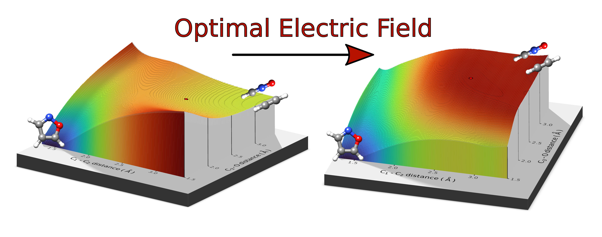

# MANULS (Make chemicAl reactioNs spontaoUs via optimaL fieldS)

A program to calculate the smallest electric field to make a chemical reaction barrierless.

This first version of the code works with 1-D and  2-D scans of the potential energy surface. A script is provided to extract the relevant data from ORCA relaxed scan calculations.

## Jump-Start Guide 

### Documentation

You can find the documentation in PDF format, along with a worked example, [here](https://github.com/MSeveri96/MANULS/MANULS_documentaton.pdf) in this repository 

### Prerequisites

1. Python 3
2. Numpy
3. Matplotlib (optional)

Usually the `numpy` and `matplotlib` libraries can be installed using the `pip` or `pip3` (for python3) package. 

For instance: `pip install numpy matplotlib`

### Download and Usage

MANULS can be dowloaded using the `git clone` command or using the green button at the top of this page. After pressing the button you can choose "download ZIP", unzip the folder and run the code.

To run the the code you need to:
1. Have a scan of the potential energy surface, along with the dipole moment vector and the polarizability for each point of the scan.
2. Prepare the data for the code (see the [documentation](https://github.com/MSeveri96/MANULS/MANULS_documentaton.pdf)). We provide a script to automatically extract the data from a ORCA calculation.
3. Unzip MANULS in a directory of your choice.
4. Modify the file MANULS_2D.py or MANULS_1D.py files putting the correct location of the files containing your data and the scan.
5. Run the code with `python3 MANULS_2D.py` or `python3 MANULS_1D.py`. If you prefer you can run the code in your favorite IDE as well.

### Output
 
 The code produces two files: `external_electric_fields.txt` and 'coordinates_bbps.txt`.
 
`external_electric_fields.txt` contains, at its top, the coordinates of the optimal bond-breaking-point and the optimal external electric field, the optimal external electric field is the field with the smallest amplitude capable of removing the energy barrier of a chemical reaction.
 
`coordinates_bbps.txt` is mainly for the interested user and for debugging purposes. More information is available in the [documentation](https://github.com/MSeveri96/MANULS/MANULS_documentaton.pdf.
 
 

## Citation

## Questions?

If something is unclear or for any kind of question you are encouraged to write to the maintainer of this repository (marco.severi6@unibo.it) or to post in the [Discussions section](https://github.com/MSeveri96/PALLAS/discussions). Every comment, question or suggestion is more than welcome!

If you spot a bug in the code (thanks!) you can post in the [Issues section](https://github.com/MSeveri96/PALLAS/issues) or write to the maintainer.
